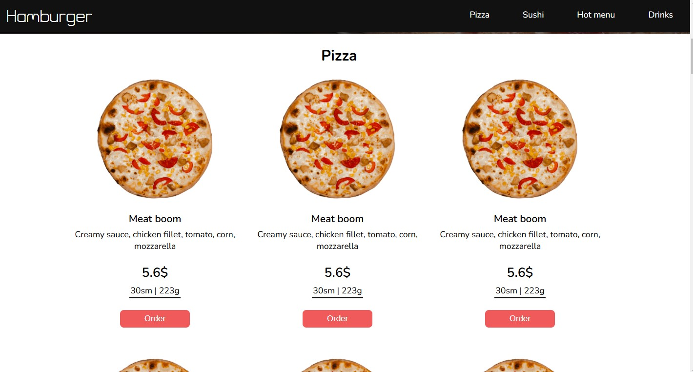

# restaurant_vue

A Vue.js frontend application for a restaurant‑related website or interface.

This project is built using Vue and follows a standard Vue CLI structure with frontend components and static resources.

## 🚀 Features

- Built with Vue.js  
- Modular components and views  
- Frontend UI for restaurant functionality (e.g., menus, pages)  
- Static assets in `public/` (images, icons)

## 🛠️ Installation

Make sure you have **Node.js** and **npm** installed.

```bash
npm install
```

img



